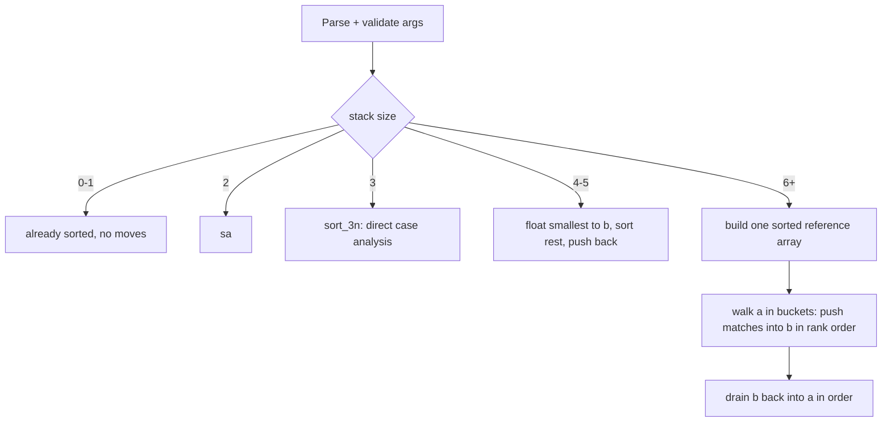
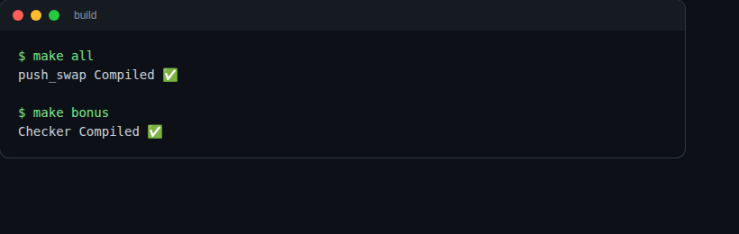
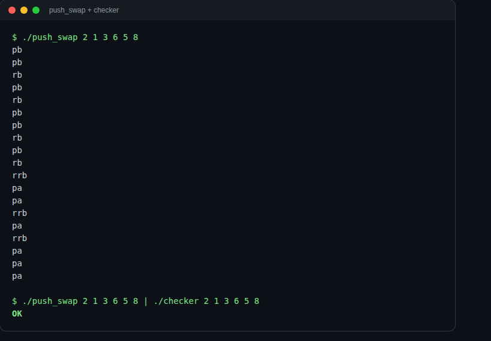
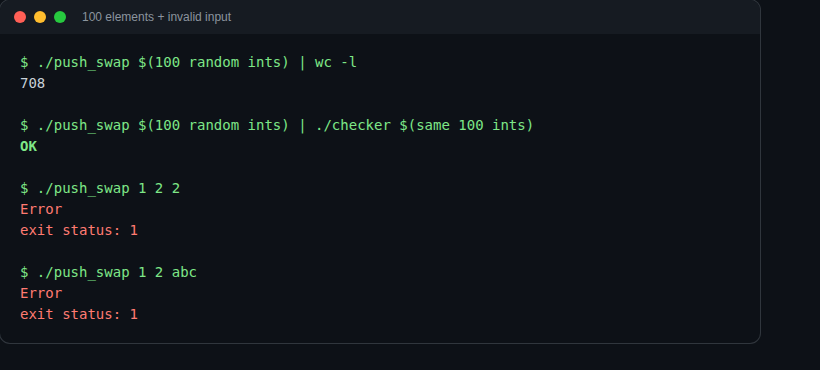

<p align="center"><b>push_swap</b> — sort a stack of integers with only two stacks and eleven moves, in as few moves as possible.</p>

<p align="center">


</p>

## What it is

`push_swap` takes a list of integers as arguments and prints the shortest
sequence of moves it can find to sort them, using two stacks (`a`, `b`)
and this fixed instruction set: `sa sb ss pa pb ra rb rr rra rrb rrr`.
`checker`, the bonus program, reads a move sequence from stdin and
replays it to confirm it actually sorts the input. No sorting library,
no data structure beyond a singly linked list: the whole thing is built
from a from-scratch libft and `get_next_line`.

```sh
$ ./push_swap 2 1 3 6 5 8
pb
pb
rb
pb
rb
...
$ ./push_swap 2 1 3 6 5 8 | ./checker 2 1 3 6 5 8
OK
```

## Quick start

```sh
make        # push_swap
make bonus  # checker
./push_swap 2 1 3 6 5 8
./push_swap 2 1 3 6 5 8 | ./checker 2 1 3 6 5 8   # OK
```

Verified on a clean checkout: `make all` builds in ~2.3s, `make bonus` in
~0.5s, no extra dependencies beyond `cc` and `make`. On invalid input
(non-integer, duplicate, or out-of-`int`-range value) it prints `Error`
to stderr and exits 1. No arguments: exits 0, no output. Already sorted:
no output.

## How it sorts



Sizes 2-5 get dedicated hand-picked move sequences instead of the general
algorithm, because for that few elements a general bucket sort spends
more moves than just handling the cases directly. From 6 elements up,
one sorted reference array is built up front and `a` is walked once,
pushing each value into `b` as soon as it falls in the current bucket;
bucket width scales with input size (`size/6`, `size/14`, `size/12`
tiers) to trade off number of passes against rotation cost. The two
smaller tiers were swept against 100+ random trials plus adversarial
orderings (descending, alternating) to find divisors that lower the
average without regressing the worst case.

Measured move counts (random input, no duplicates):

| n (elements) | moves |
|---:|---:|
| 5 | 7 |
| 100 | 575 |
| 500 | 5,107 |
| 1,000 | 15,249 |

## checker (bonus)

```sh
./push_swap 2 1 3 6 5 8 | ./checker 2 1 3 6 5 8
```

`checker` doesn't share any state with `push_swap` — it rebuilds its own
stack from argv and replays whatever operations arrive on stdin, one
line at a time, then reports `OK` (sorted, `b` empty) or `KO`. That keeps
verification independent of whatever the solver actually did internally.

## Screenshots

| | |
|---|---|
|  | Clean build: `make all` then `make bonus`. |
|  | `push_swap` sorting 6 elements, `checker` confirming the result. |
|  | 100 random elements sorted and verified, then invalid input (duplicate, non-integer) rejected with `Error`. |

## Notable bits

- Both binaries build with `-Wall -Wextra -Werror -fsanitize=address -g3`
  on every build, debug and release. AddressSanitizer caught a real
  heap-buffer-overflow in the large-stack sort path and an
  uninitialized-memory bug in `checker`'s argument parser during review;
  it stays on because the cost (needing `libasan` at runtime, a bit of
  runtime overhead) is small next to catching that class of bug.
- Argument parsing accepts both `./push_swap 1 2 3` and
  `./push_swap "1 2 3"` by joining argv into one string and re-splitting
  on whitespace before validating each token.
- Everything reachable from `main` is hand-rolled: linked-list stack,
  libft, `get_next_line`. No libc sort, no `<string.h>` beyond what the
  project reimplements.

## Build targets

```sh
make        # push_swap
make bonus  # checker
make clean  # remove libft/gnl object files
make fclean # clean + remove push_swap and checker binaries
make re     # fclean + all
```

## License

MIT, see [LICENSE](LICENSE).
